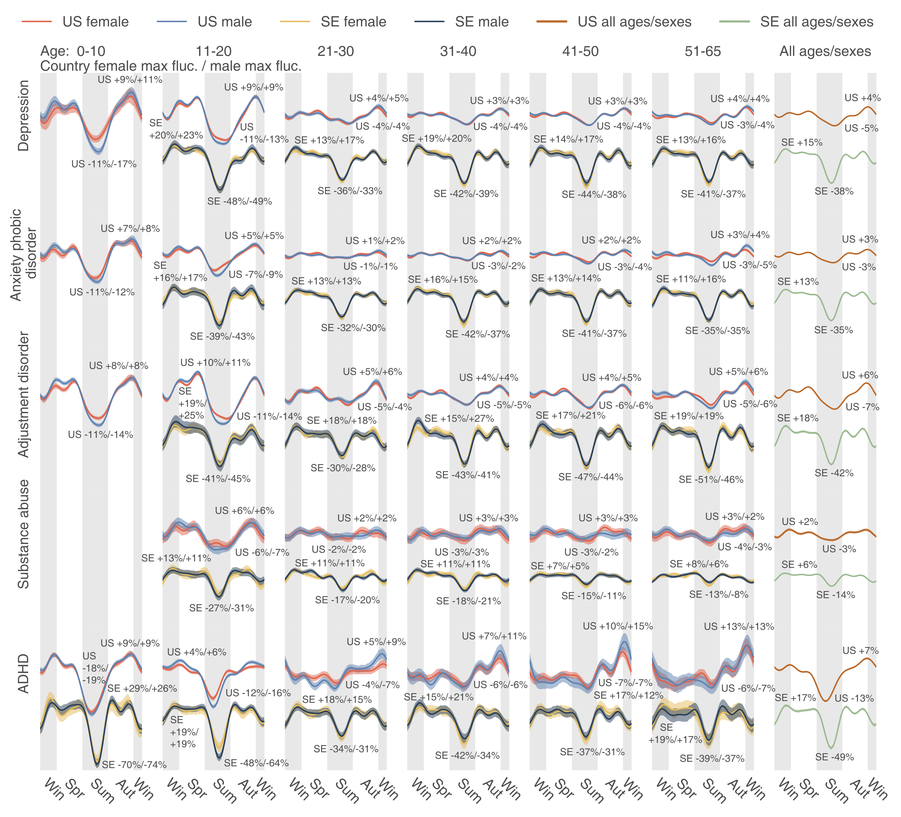

# Are Psychiatric Disorders as Seasonal as Infections?

It is widely accepted that many infectious diseases are seasonal, though no thorough investigation has been done to probe the seasonality of other disease systems. In this study, we designed a statistical model to infer the seasonality of 33 neuropsychiatric and 47 infectious diseases in both the US and Sweden, based on two large-scale, nation-wide databases. The results indicate that neuropsychiatric diseases may be as seasonal as infectious diseases. In Sweden, the variation of neuropsychiatric diseases is much larger than in the US whereas the seasonal variations of infectious diseases in these two nations are similar, potentially pinning the pathogenesis of neuropsychiatric diseases on circadian rhythms. The study thus suggests that we should contemplate the influence of the sleep-wake cycle, light exposure, and circadian rhythms on the development of neuropsychiatric diseases.

  

  

